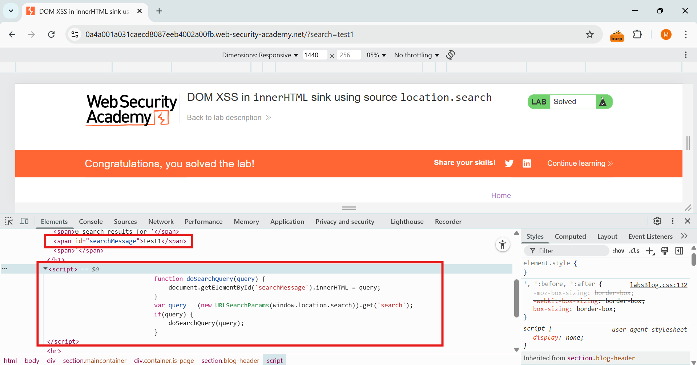

🧪 PortSwigger XSS Lab 04 – DOM XSS in innerHTML sink using source location.search

🔍 Lab Description
This lab contains a DOM-based cross-site scripting vulnerability in the blog search functionality. The value from location.search is assigned directly to a div using .innerHTML, making it vulnerable to injection.

🔗 Lab URL: https://portswigger.net/web-security/cross-site-scripting/dom-based/lab-innerhtml-sink

💣 Payload

Full URL:
https://0a340043030490c78060595300f6008f.web-security-academy.net/?search=

🛠️ Exploit Strategy
1. Analyzed JavaScript and confirmed location.search is inserted into innerHTML.
2. Injected an  tag with a broken src and onerror calling alert(origin).
3. Loaded the page with payload in query string → HTML executed inline.

✅ Outcome
The alert popped with the current page origin, confirming successful DOM XSS.

🧠 Lesson Learned
Using .innerHTML with unsanitized user input leads to immediate XSS. Always prefer .textContent or DOM sanitizers like DOMPurify.

