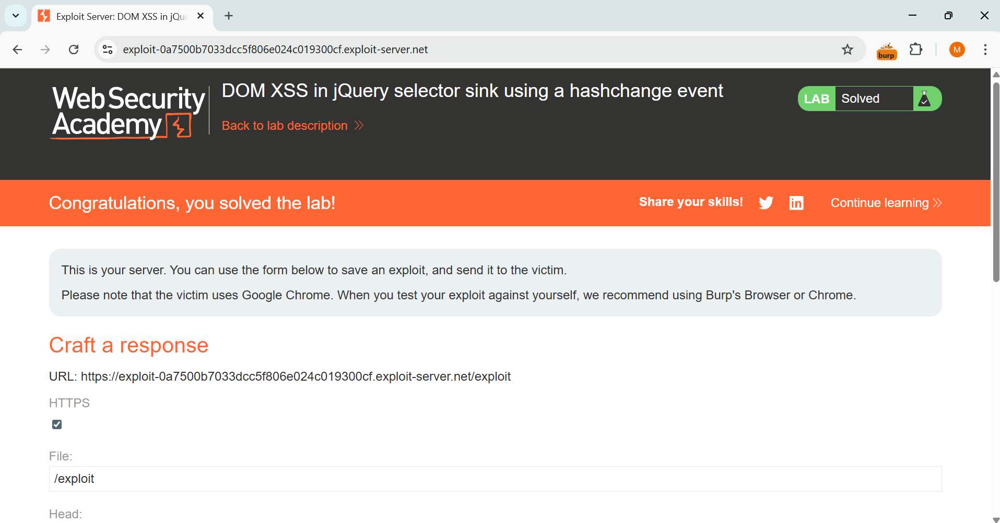
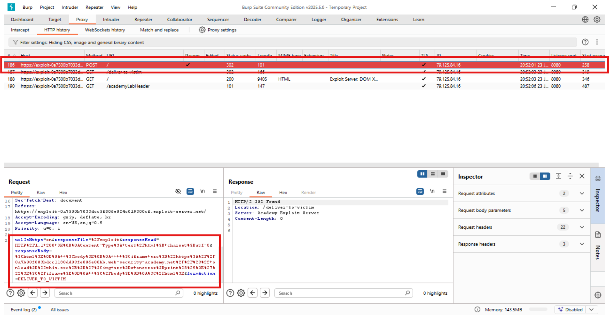
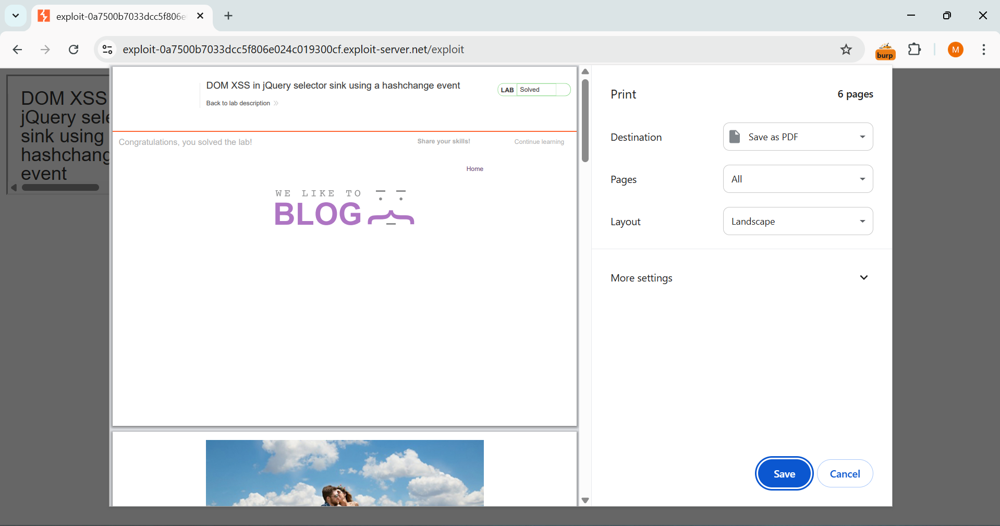
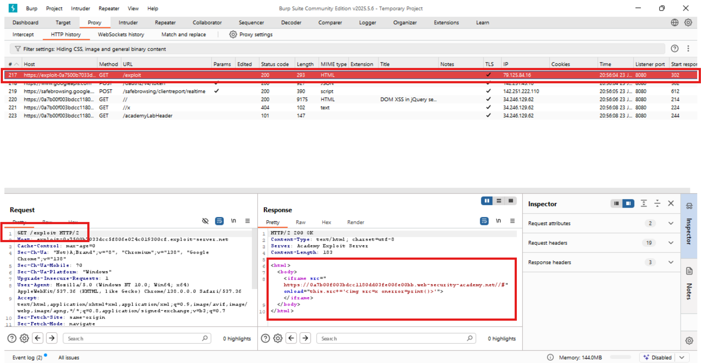

🔪 PortSwigger XSS Lab 06 – DOM XSS in jQuery Selector Sink Using hashchange Event

🔍 Lab Description
This lab contains a DOM-based XSS vulnerability triggered via a hashchange event. The application uses the value from location.hash inside a jQuery :contains() selector without sanitization, allowing injection of HTML and JavaScript.

🔗 Lab URL
https://portswigger.net/web-security/cross-site-scripting/dom-based/lab-jquery-selector-hash-change-event

💣 Exploit Payload (Delivered via Exploit Server)
<iframe src="https://<lab-id>.web-security-academy.net/#" onload="this.src+=''"></iframe>

🛠️ Exploit Strategy:
1. The page listens for hashchange and uses the value inside jQuery’s :contains() selector.
2. Injected a payload that breaks out of the selector and appends a malicious  tag with onerror=print().
3. Hosted the payload on the exploit server provided by the lab.
4. When the victim (Chrome browser) visits the exploit URL, the iframe loads the vulnerable page and triggers the hashchange.

⚠️ Important: This lab is only solved when the payload is delivered through the exploit server and executed by the victim.

✅ Outcome
The victim visited the exploit page, and the browser’s print dialog appeared — confirming successful DOM XSS execution and solving the lab.

🧠 Lesson Learned
Using unsanitized location.hash values inside jQuery selectors (like :contains()) is dangerous. To prevent this:
1. Sanitize hash and query inputs before use.
2. Avoid inserting user input directly into jQuery selectors.
3. Consider using libraries like DOMPurify and enforcing Content Security Policy (CSP).

